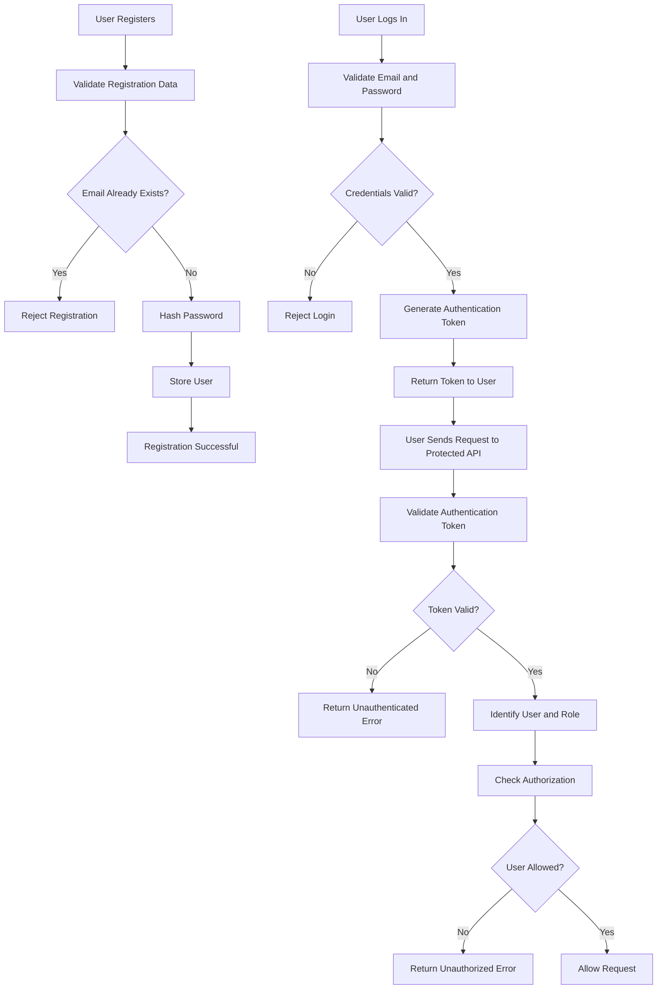

# Authentication and Authorization Flow

This document describes how users register, log in and access protected resources in the Order Management System.

## Authentication Flow

## Registration Flow

When a customer registers:

1. The server validates the registration data.
2. The server checks whether the email already exists.
3. Duplicate email registration is rejected.
4. The password is hashed before it is stored.
5. The user account is created.
6. The registered customer can later log in.

Passwords must never be stored as plain text.

## Login Flow

When a user logs in:

1. The user provides their login credentials.
2. The server validates the credentials.
3. Invalid credentials are rejected.
4. If the credentials are valid, the server creates authentication credentials/token.
5. The token is returned to the authenticated user.

## Protected Request Flow

For protected APIs:

1. The client sends its authentication token with the request.
2. The backend validates the authentication information.
3. If authentication fails, the request is rejected.
4. If authentication succeeds, the backend identifies the user.
5. The backend checks the user's role and permissions.
6. Resource ownership is checked when required.
7. The request is allowed only when all required checks pass.

## Authorization Rules

### Customer

A Customer can access their own:

- Cart
- Addresses
- Orders
- Profile

A Customer must not be able to access resources owned by another customer.

A Customer must not be allowed to perform Admin or Operations actions.

### Admin

An Admin can perform permitted administrative operations such as:

- Manage products
- Manage categories
- Manage coupons
- Manage inventory
- Access permitted system data
- View audit logs

Admin permissions must be enforced by the backend.

### Operations

An Operations user can:

- Access permitted orders
- Process orders
- Update fulfillment-related order statuses

Operations users must follow valid order status transitions.

## Authentication vs Authorization

Authentication answers:

"Who is this user?"

For example:

A user logs in successfully and the backend identifies the user.

Authorization answers:

"What is this user allowed to do?"

For example:

A logged-in Customer tries to create a product.

The user is authenticated, but they are not authorized to perform that Admin action.

## Resource Ownership Example

Suppose:

Customer A owns Order 101.

Customer B tries to access Order 101.

The backend must:

1. Authenticate Customer B.
2. Load the requested order.
3. Check who owns the order.
4. Detect that Customer B does not own it.
5. Reject access.

Authentication alone is therefore not enough. Ownership and role permissions must also be checked.

## Security Rules

- Passwords must be hashed before storage.
- Login credentials must be validated.
- Protected endpoints require authentication.
- Role restrictions must be enforced server-side.
- Customers can access only resources they own.
- Admin and Operations permissions must be explicitly enforced.
- Sensitive credentials and tokens must not be written to normal application logs.